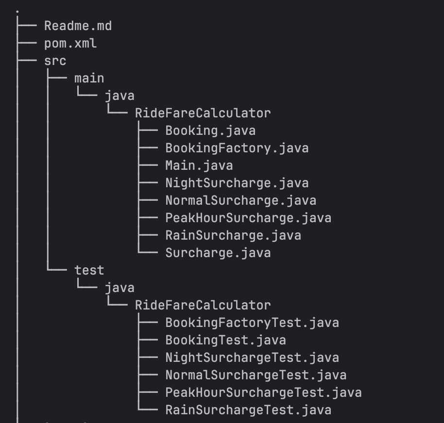
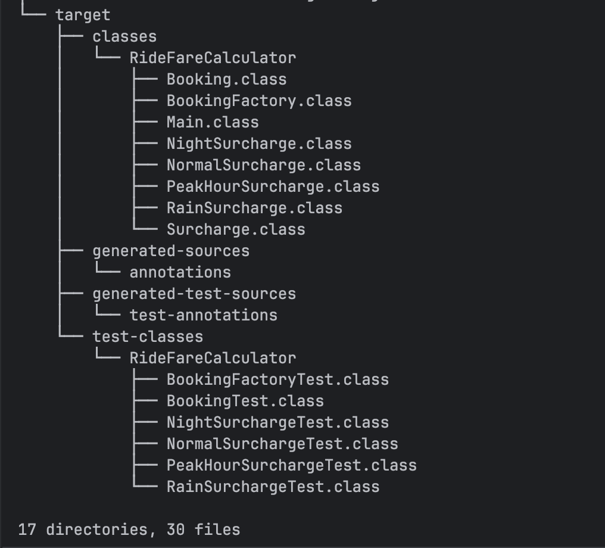
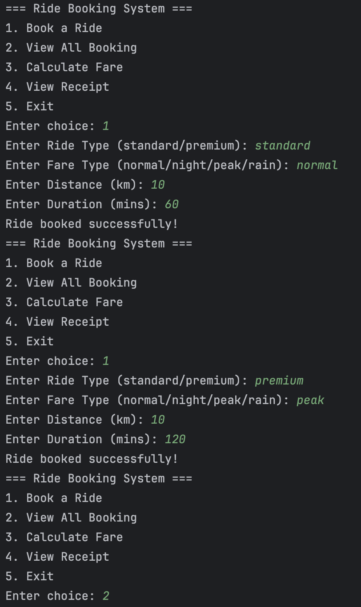
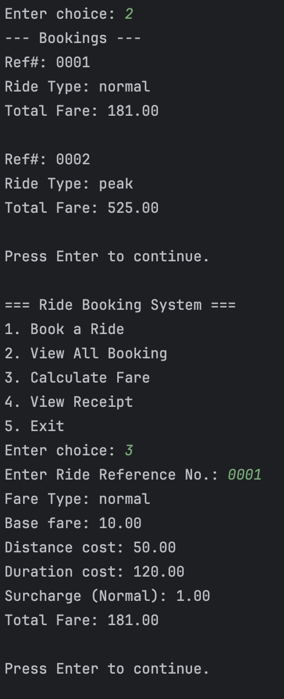
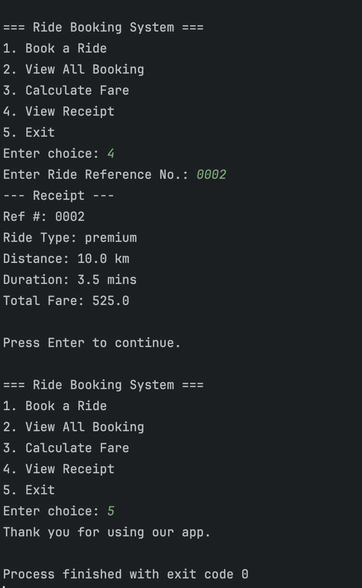

# **Java OOP Capstone Project**

---

## Group #9 - Syntax Error

* Lazaro, Cade Virgil C.
* Isorena, Jovito Jr. E.
* Tuan, Joshua Miguel R.

---

 
 This project outlines a simple Ride Booking System designed to facilitate convenient and transparent ride services. Users can book rides, calculate fares based on various factors, and view detailed receipts. The system supports different ride types (Standard and Premium) and calculates fares considering distance, duration, and applicable surcharges. The surcharge model incorporates Peak, Night, Rain, and Normal conditions to dynamically adjust pricing. The core functionalities include ride creation, accurate fare computation, and the generation of comprehensive fare summaries. 

 
___

## Project Structure

---

## Screenshots of the Output

